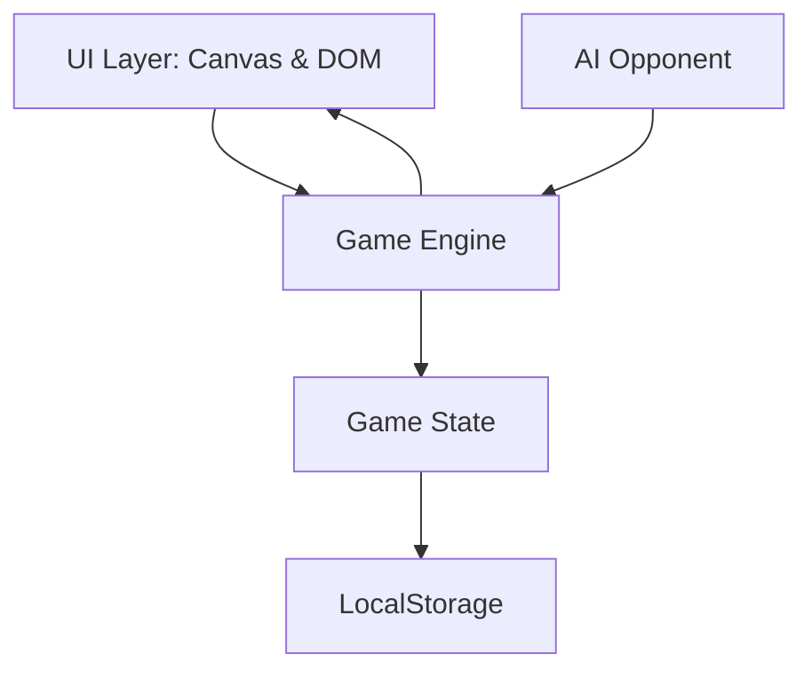

# System Architecture: Hexagon Strategy Game

## Overview
The game follows a modular "Engine-UI-AI" architecture to separate logic from presentation and decision-making.

## Layers
1. **State Layer:** Pure data structure representing the world map and player stats.
2. **Engine Layer:** Pure functions for game rules (combat, movement, territory capture).
3. **UI Layer:** Handles user input and renders the state via Canvas.
4. **AI Layer:** Analyzes the state and proposes moves to the Engine.

## Communication
- The UI triggers `Actions` on the Engine.
- The Engine updates the `State`.
- The UI re-renders based on the new `State`.
- AI runs in a simplified loop after the Player ends their turn.
