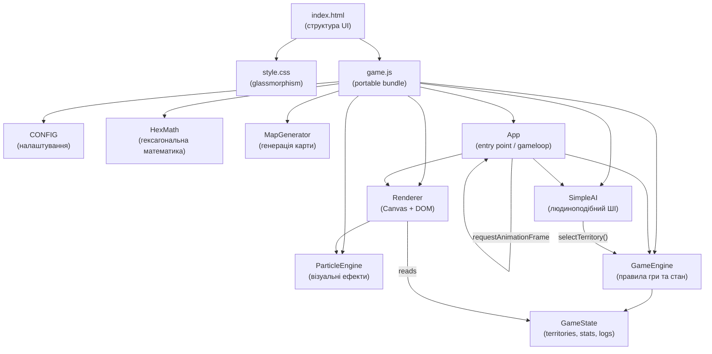

# System Architecture: Hexagon Strategy Game (v1.2)

## Огляд

Гра реалізована як **portable self-contained bundle** — весь код в одному файлі `game.js` без залежностей та збірника.

## Компонентна схема



## Потік даних

```
User Click → App.handleClick()
           → GameEngine.selectTerritory()
           → GameEngine updates State (units, owner, animations, logs, history)
           ← Renderer.draw(state) [кожен кадр]
           ← Renderer.updateDOM(state) [кожен кадр]
```

```
End Turn → GameEngine.nextTurn()
         → currentPlayer = 'ai'
         → App.loop() triggers SimpleAI.playTurn() [async]
         → AI calls selectTerritory() + move() with delays
         → GameEngine.nextTurn() → currentPlayer = 'player'
```

## Шари

| Шар | Клас | Відповідальність |
|-----|------|-----------------|
| Config | `CONFIG` | Константи — розмір карти, кольори, геймплей |
| Utils | `HexMath` | Чиста математика координат |
| Data | `MapGenerator` | Генерація масиву Territory[] |
| Engine | `GameEngine` | Правила, стан, бойова механіка, статистика |
| AI | `SimpleAI` | Рішення на базі стану + personality + memory |
| Render | `Renderer` | Canvas рендер + DOM HUD оновлення |
| Particles | `ParticleEngine` + `Particle` | Процедурні ефекти |
| App | `App` | Ігровий цикл, input handling, UI flow |

## Ігровий цикл

```
window.onload → new App()
     ↓
App.loop() [requestAnimationFrame, ~60fps]
     ├── if ai turn && !aiPlaying → SimpleAI.playTurn() [once, async]
     └── Renderer.draw(state)
              ├── drawHex() × N
              ├── drawAnimations()
              ├── ParticleEngine.update() + draw()
              └── updateDOM()
```

## AI цикл (async)

```
SimpleAI.playTurn()
  ├── thinkingDelay('start')        [800 ± 400мс × multiplier]
  ├── updateStrategy()              [expand / defend / aggress]
  ├── handleReinforcements()        [scored placement + fake mistakes]
  │     └── thinkingDelay('reinforce') per placement
  ├── [loop max 15-25 actions]:
  │     ├── performBestAction()     [scored attacks + moves]
  │     └── thinkingDelay('action') [400 ± 300мс × multiplier]
  ├── thinkingDelay('end')
  └── GameEngine.nextTurn()
```

## Routing / Стани гри

```
App.gameState:
  'menu'   → Показано #main-menu overlay
  'active' → Гра запущена, gameloop рендерить
```

GameEngine.state.status:
```
  'ongoing' → Гра триває
  'won'     → Гравець переміг (confetti + stats screen)
  'lost'    → Гравець програв (stats screen)
```
